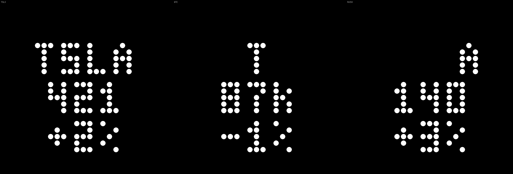

# Glyph Stock Ticker

Glyph Toy for the **Nothing Phone (3)** that shows live stock and crypto prices on the 25×25 Glyph Matrix.

Built with the [Glyph Matrix Developer Kit](https://github.com/Nothing-Developer-Programme/GlyphMatrix-Developer-Kit), based on the [Example Project](https://github.com/Nothing-Developer-Programme/GlyphMatrix-Example-Project).

**Device:** Nothing Phone (3) · `Glyph.DEVICE_23112` · Android 15+

## Preview

<p align="center">
  
</p>

Long-press cycles symbol: **TSLA** → **BTC** → **NVDA**. Previews use the [official Phone (3) LED allocation](https://github.com/Nothing-Developer-Programme/GlyphMatrix-Developer-Kit/blob/main/image/23111_25111_LED_allocation.svg) (621 LEDs). BTC example uses compact `87k` — full integer BTC prices are wider on the matrix.

## Features

- **Default symbol:** Tesla (`TSLA`)
- **Long-press Glyph Button:** cycle `TSLA` → `BTC` → `NVDA` → …
- **Display:** symbol / integer price / integer daily change (e.g. `TSLA` / `421` / `+2%`)
- **Auto-refresh:** every 5 minutes, on AOD ticks, and immediately on symbol switch
- **No API key** — Yahoo Finance public chart endpoint

## Install (prebuilt APK)

1. Download [`releases/v1.4.0/glyph-stock-ticker-v1.4.0.apk`](releases/v1.4.0/glyph-stock-ticker-v1.4.0.apk)
2. Install: `adb install -r glyph-stock-ticker-v1.4.0.apk` (or tap the file on the phone)
3. Open **Glyph Stock Ticker** → **Activate Glyph Toy**
4. In **Settings → Glyph Interface → Glyph Toys**, drag **Stock Ticker** to **Active**
5. Flip the phone or use Glyph Touch to view; **long-press** the Glyph Button to switch symbol

## Build from source

Requires **JDK 17** (not just a JRE).

```bash
export JAVA_HOME=/path/to/jdk-17
cd glyph-tesla-stock
./gradlew assembleDebug
adb install -r app/build/outputs/apk/debug/app-debug.apk
```

## Project layout

| Path | Purpose |
|---|---|
| `app/.../tesla/TeslaStockService.kt` | Glyph Toy service |
| `app/.../tesla/StockFetcher.kt` | Yahoo Finance + symbol list |
| `app/.../tesla/MatrixLedMask.kt` | Official 621-LED mask |
| `app/.../demos/GlyphMatrixService.kt` | Lifecycle wrapper (from Example Project) |

## Data & disclaimer

- Prices from [Yahoo Finance](https://finance.yahoo.com/) chart API (unofficial, no warranty).
- **Not financial advice.** For personal / hobby use.
- Yahoo may rate-limit or change the API without notice.

## License

MIT — see [LICENSE](LICENSE). Based on Nothing's Example Project; stock-ticker logic is original.

## Topics (for GitHub)

`glyph-toy` `glyph-matrix` `nothing-phone` `nothing-phone-3` `android` `kotlin`

## Related

- [Glyph Matrix toy notes](../glyph-matrix-toy.md) — lessons learned building toys
- [glyph-simulator](../glyph-simulator/) — preview layouts with the official LED map